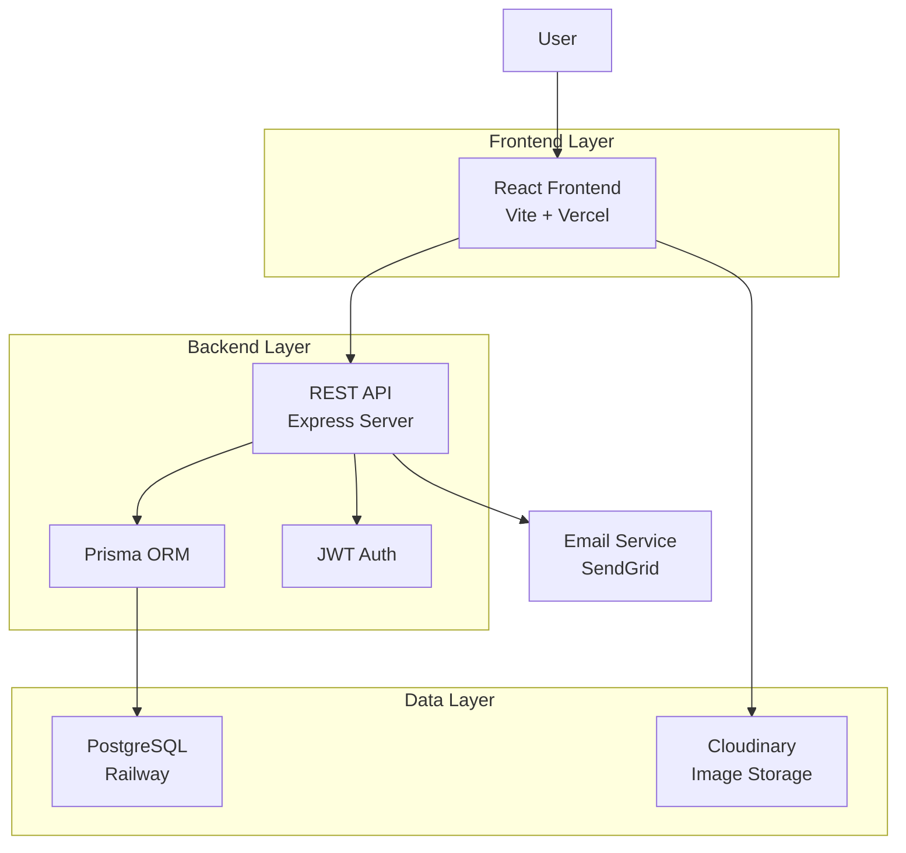

# Digital Store Fullstack Architecture Document

## Introduction

This document outlines the complete fullstack architecture for Digital Store, including backend systems, frontend implementation, and their integration. It serves as the single source of truth for AI-driven development, ensuring consistency across the entire technology stack.

This document outlines the architecture for separate frontend and backend repositories, ensuring consistency across the technology stack while allowing independent development and deployment.

## Change Log

| Date | Version | Description | Author |
|------|---------|-------------|--------|
| 2025-10-29 | v1.0 | Initial architecture document creation | Architect Agent |
| 2025-10-29 | v1.1 | Changed from monorepo to separate repositories | Architect Agent |

## High Level Architecture

### Technical Summary

Digital Store is a fullstack web application built with modern JavaScript technologies to create a sustainable marketplace for buying and selling used products. The frontend utilizes React with Vite for rapid development and optimized production builds, providing a responsive user interface that works seamlessly across desktop and mobile devices. The backend is powered by Node.js and Express, using Prisma as an ORM for type-safe database interactions with PostgreSQL, ensuring robust data management and scalability.

The application follows a client-server architecture with RESTful API communication between the frontend and backend layers. Authentication is handled through JWT tokens for secure user sessions, while the loyalty program tracks points earned from purchases and product drop-offs. Infrastructure is designed for cloud deployment with separate hosting for frontend static assets and backend API services, enabling independent scaling and deployment cycles.

This architecture directly supports the PRD goals by providing a performant, secure platform for marketplace transactions, implementing a gamified loyalty system to encourage user engagement, and integrating donation features to promote sustainable consumption. The chosen technologies balance development velocity with production reliability, allowing the team to iterate quickly while maintaining code quality and user experience standards.

### Platform and Infrastructure Choice

**Platform:** Vercel (Frontend) + Railway (Backend)  
**Key Services:** Vercel for frontend hosting and CDN, Railway for PostgreSQL database and backend deployment, Cloudinary for image storage  
**Deployment Host and Regions:** Global CDN via Vercel, Database in US East region via Railway  

After evaluating options including AWS fullstack, Google Cloud, and Azure, Vercel + Railway was selected for its developer-friendly deployment experience and cost-effectiveness for this scale. Vercel provides excellent performance for the React frontend with automatic scaling and global CDN, while Railway offers managed PostgreSQL with simple deployment for the Node.js backend. This combination minimizes infrastructure complexity while providing the scalability needed for a growing marketplace.

### Repository Structure

**Structure:** Separate Repositories  
**Frontend Repository:** digital-store-frontend (React application)  
**Backend Repository:** digital-store-backend (Express API server)  
**Shared Code:** Published as npm packages for types and utilities  

The project is organized into two separate repositories: one for the frontend React application and one for the backend Express API. Shared TypeScript types and utilities are published as npm packages to enable code sharing between repositories. This structure allows independent deployment and scaling of frontend and backend components while maintaining type safety across the stack.

### High Level Architecture Diagram



### Architectural Patterns

- **Component-Based UI:** Reusable React components with TypeScript - _Rationale:_ Maintainability and type safety across large codebases, enabling rapid feature development
- **Repository Pattern:** Abstract data access logic with Prisma - _Rationale:_ Enables testing and future database migration flexibility, separates business logic from data persistence
- **RESTful API Pattern:** Standard HTTP methods for CRUD operations - _Rationale:_ Simple, widely understood interface between frontend and backend, supports caching and tooling
- **JWT Authentication Pattern:** Token-based auth with refresh tokens - _Rationale:_ Stateless authentication suitable for scalable web applications, secure session management
- **Separate Repositories Pattern:** Independent frontend and backend repositories - _Rationale:_ Enables independent deployment cycles and scaling, with shared code via npm packages

## Tech Stack

This section defines the definitive technology selection for the entire Digital Store project. All development must use these exact versions and tools.

| Category | Technology | Version | Purpose | Rationale |
|----------|------------|---------|---------|-----------|
| Frontend Language | TypeScript | 5.3+ | Type-safe frontend development | Provides compile-time type checking, better IDE support, and reduces runtime errors |
| Frontend Framework | React | 18.2+ | Component-based UI library | Industry standard for modern web applications, excellent ecosystem and community support |
| UI Component Library | None (Custom) | N/A | Basic UI components | Keep bundle size small, full control over styling and behavior |
| State Management | React Context + useReducer | Built-in | Client-side state management | Simple, built-in solution for this scale; can scale to Redux if needed |
| Backend Language | TypeScript | 5.3+ | Type-safe backend development | Consistent with frontend, enables shared types, better maintainability |
| Backend Framework | Express.js | 4.18+ | REST API server framework | Lightweight, flexible, widely adopted for Node.js APIs |
| API Style | REST | N/A | API communication pattern | Simple, standard approach for CRUD operations, easy to understand and test |
| Database | PostgreSQL | 15+ | Primary data storage | Robust, ACID-compliant, excellent for relational data with complex queries |
| ORM | Prisma | 5.7+ | Database ORM and migration tool | Type-safe database access, auto-generated types, excellent migration support |
| Cache | Redis (optional) | N/A | Session and data caching | Fast in-memory storage for sessions and frequently accessed data |
| File Storage | Cloudinary | Latest | Image and media storage | Reliable cloud storage with optimization features for marketplace images |
| Authentication | JWT | jsonwebtoken 9.0+ | User authentication | Stateless, secure token-based auth suitable for web applications |
| Frontend Testing | Jest + React Testing Library | Jest 29+, RTL 14+ | Unit and integration testing | Comprehensive testing framework with great React support |
| Backend Testing | Jest + Supertest | Jest 29+, Supertest 6+ | API testing | Consistent testing framework, excellent for HTTP endpoint testing |
| E2E Testing | Playwright | 1.40+ | End-to-end testing | Modern, reliable browser automation with cross-browser support |
| Build Tool | Vite | 5.0+ | Frontend build tool | Fast development server, optimized production builds, excellent React support |
| Bundler | Vite (Rollup) | Built-in | Asset bundling | Integrated with Vite, provides tree-shaking and code splitting |
| IaC Tool | None (Railway managed) | N/A | Infrastructure as Code | Railway handles infrastructure, reducing complexity for this scale |
| CI/CD | GitHub Actions | Latest | Automated testing and deployment | Free, integrated with GitHub, supports separate repository workflows |
| Monitoring | Vercel Analytics + Railway logs | Built-in | Application monitoring | Basic monitoring via hosting platforms, can add more if needed |
| Logging | Winston | 3.11+ | Structured logging | Flexible logging library for Node.js with multiple transports |
| CSS Framework | Tailwind CSS | 3.4+ | Utility-first CSS framework | Rapid UI development, small bundle size with purging, consistent design system |

## Data Models

This section defines the database schema using Prisma ORM for PostgreSQL. The schema is designed to support the core marketplace functionality including user management, product listings, orders, donations, and the loyalty points system.

### Database Schema Overview

The database follows a relational structure optimized for the marketplace domain. Key entities include Users, Products, Orders, Donations, and Loyalty Transactions, with appropriate relationships to support the business logic.

### Prisma Schema

```prisma
// This is the Prisma schema file
generator client {
  provider = "prisma-client-js"
}

datasource db {
  provider = "postgresql"
  url      = env("DATABASE_URL")
}

model User {
  id        String   @id @default(cuid())
  email     String   @unique
  password  String
  firstName String?
  lastName  String?
  createdAt DateTime @default(now())
  updatedAt DateTime @updatedAt

  // Relations
  products      Product[]
  orders        Order[]
  donations     Donation[]
  loyaltyTxns   LoyaltyTransaction[]

  @@map("users")
}

model Product {
  id          String   @id @default(cuid())
  title       String
  description String?
  price       Float
  category    String
  condition   String   // e.g., "new", "like-new", "good", "fair"
  images      String[] // Array of Cloudinary URLs
  isActive    Boolean  @default(true)
  createdAt   DateTime @default(now())
  updatedAt   DateTime @updatedAt

  // Relations
  sellerId    String
  seller      User     @relation(fields: [sellerId], references: [id], onDelete: Cascade)
  orderItems  OrderItem[]

  @@map("products")
}

model Order {
  id            String      @id @default(cuid())
  status        OrderStatus @default(PENDING)
  totalAmount   Float
  createdAt     DateTime    @default(now())
  updatedAt     DateTime    @updatedAt

  // Relations
  buyerId       String
  buyer         User        @relation(fields: [buyerId], references: [id], onDelete: Cascade)
  items         OrderItem[]
  donation      Donation?

  @@map("orders")
}

model OrderItem {
  id        String  @id @default(cuid())
  quantity  Int     @default(1)
  price     Float   // Price at time of order

  // Relations
  orderId   String
  order     Order   @relation(fields: [orderId], references: [id], onDelete: Cascade)
  productId String
  product   Product @relation(fields: [productId], references: [id], onDelete: Cascade)

  @@unique([orderId, productId])
  @@map("order_items")
}

model Donation {
  id          String  @id @default(cuid())
  amount      Float
  cause       String  // e.g., "Environmental Protection", "Community Support"
  isAnonymous Boolean @default(false)
  createdAt   DateTime @default(now())

  // Relations
  donorId     String
  donor       User    @relation(fields: [donorId], references: [id], onDelete: Cascade)
  orderId     String? @unique
  order       Order?  @relation(fields: [orderId], references: [id], onDelete: SetNull)

  @@map("donations")
}

model LoyaltyTransaction {
  id          String   @id @default(cuid())
  type        TransactionType
  points      Int      // Positive for earning, negative for redemption
  description String
  createdAt   DateTime @default(now())

  // Relations
  userId      String
  user        User     @relation(fields: [userId], references: [id], onDelete: Cascade)
  orderId     String?  // Reference to order that triggered points (optional)
  order       Order?   @relation(fields: [orderId], references: [id], onDelete: SetNull)

  @@map("loyalty_transactions")
}

enum OrderStatus {
  PENDING
  CONFIRMED
  SHIPPED
  DELIVERED
  CANCELLED
}

enum TransactionType {
  EARNED_PURCHASE
  EARNED_DROPOFF
  REDEEMED
}
```

### Model Relationships and Constraints

- **User-Product**: One-to-many (seller can list multiple products)
- **User-Order**: One-to-many (buyer can have multiple orders)
- **User-Donation**: One-to-many (user can make multiple donations)
- **User-LoyaltyTransaction**: One-to-many (user can have multiple point transactions)
- **Order-OrderItem**: One-to-many (order contains multiple items)
- **Product-OrderItem**: One-to-many (product can be in multiple orders)
- **Order-Donation**: One-to-one optional (donation can be linked to an order)
- **Order-LoyaltyTransaction**: One-to-many optional (order can trigger multiple point transactions)

### Data Integrity and Validation

- Email uniqueness enforced at database level
- Foreign key constraints ensure referential integrity
- Order total amount calculated from order items
- Points balance computed from loyalty transactions (not stored directly)
- Soft deletes not implemented (products use `isActive` flag instead)

### Indexing Strategy

- Primary keys on all tables (CUID for global uniqueness)
- Unique constraint on user email
- Composite unique constraint on order-item pairs
- Indexes on frequently queried fields: `sellerId`, `buyerId`, `productId`, `orderId`, `userId`
- CreatedAt indexes for chronological sorting

### Migration Strategy

Prisma migrations will be used for schema evolution:
- Initial migration creates all tables and relationships
- Future migrations for feature additions (e.g., product categories table)
- Rollback capability for deployment safety
- Migration files committed to version control